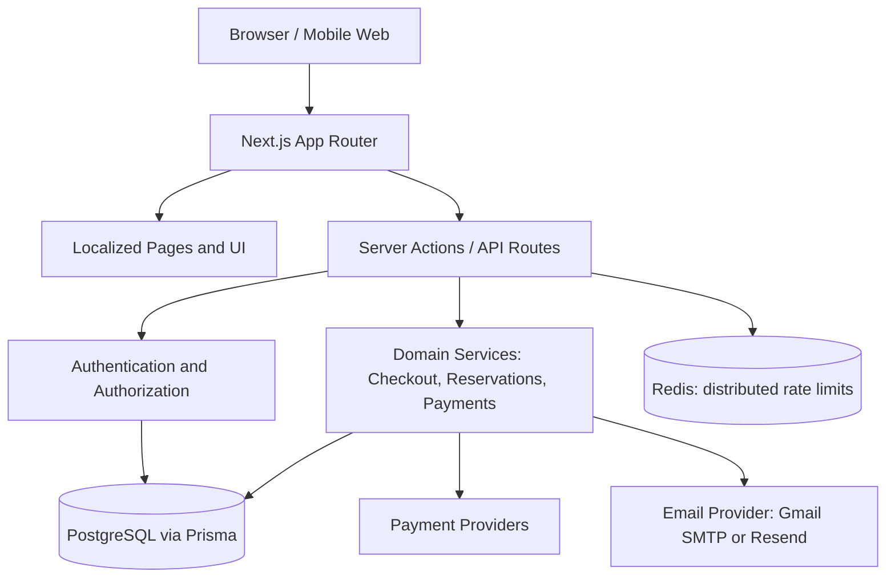

# Flame Architecture

## Request and data flow

## Boundaries

- UI components render data and submit validated forms; security decisions belong on the server.
- Server Actions validate untrusted form input with Zod and derive prices from database values.
- Prisma is the database access layer. Monetary order snapshots are persisted with the order.
- Payment callbacks must verify provider authenticity and call the shared payment completion service.
- Email provider selection is controlled by `EMAIL_PROVIDER`; missing credentials are a failed delivery, not a success.
- Rate limits use Redis when configured. Process-local fallback is defense-in-depth only and is not shared across multiple instances.

## Cross-cutting controls

- Sessions are stored/revocable and use server-only helpers.
- Admin mutations call server-side authorization; UI visibility is not authorization.
- Audit events avoid recording passwords, session tokens, API keys, or raw payment secrets.
- Locale dictionaries live in `src/messages`; `scripts/audit-i18n.mjs` checks key parity.
